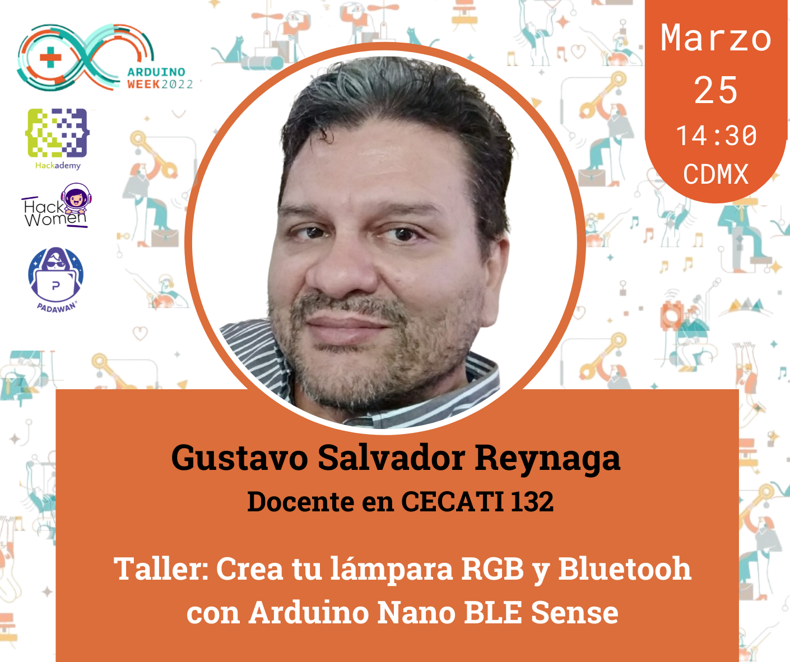

# Padawans Arduino Week 2022

## Introducción.
Hoy en dia las aplicaciones basadas en el protocolo **WiFi**, son numerosas y bastantes difundidas, por lo tanto, existe mucha informacion de como crear una utlizando el ecosistema [Arduino](https://www.arduino.cc/) o similar, pero existe otro protocolo, el **Bluetooh Low Energy o BLE**, el cual como su nombre lo indica, esta diseñado para ser de bajo consumo y resuelve problemas donde WiFi puede no hacerlo, a diferencia de este ultimo, BLE no esta tan difundido y por ende, hay poda informacion, de como implementarlo.

Para este taller, se usara la tarjeta [Arduino Nano BLE Sense](https://docs.arduino.cc/hardware/nano-33-ble-sense), la cual ademas de tener conectividad BLE, cuanta con 5 sensores.

Sensor  		 | # de parte
------------- | -------------
IMU				 | LSM9DS
Microphone	 | MP34DT05
Gesture, light, proximity | APDS9960
Barometric pressure 	   | LPS22HB
Temperature, humidity		| HTS221

Con los cuales, se pueden crear una muy buena cantidad de aplicaciones/soluciones.

En cuanto a la parte de ver/mostrar los datos, se usara App Inventor, el por que de esto, es muy sencillo, la rapidez de crear apps moviles sin necesidad de tener conocmientos bastos en programcion, como un servidor 

:wink:

Objetivo.
Crear una solución BLE (Bluetooth Low Energy) basada en Arduino y App Inventor, para operar un grupo de leds RGB (Neopixeles)

